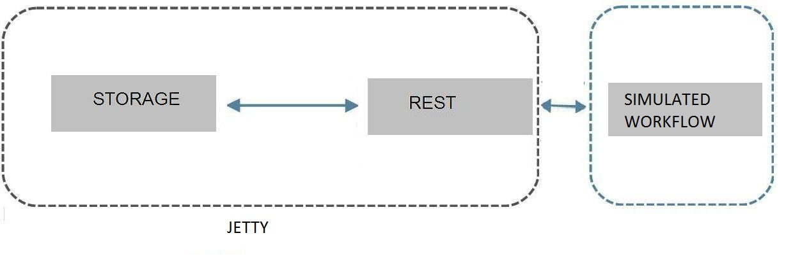

#Video rental store

# The solution

## Installation requirements
Java JVM 7 and later .
It runs on its own embedded server with Jetty,no servlet container like Tomcat is needed

## API overview
- Generate rental: POST /rentals/save 
- Return a rental: GET /rentals/return 
- port is 8080  

## Application design

Dropwizard framework is used and the application is built as an only jar file with an embedded server Jetty.
The application was built with Eclipse , Maven and Java 7+ with the following command:
mvn package -DskipTests
Actors and user cases were identified before proceeding to design

 

This is a sequence for the two API calls mentioned before.

## Assumptions and limitations
- The rental basket and the returned basket consist of the same films.
- The duration of rental is the same for all movies in the basket.
- A maximum acceptable size for the  duration of lease and the size of the cart are fixed and 
errors are exposed to users if this values are exceeded.
- The maximum length of a rental is 1000 days. In the case the user presents a such retutn an 
error warning is emitted. No other actions like automatic warning to the user or alarm to 
administrator is previously emitted .
- Elapsed Days are represented as integers.

## Database
- The database is implemented in Ram memory and is already filled with some movies when
the application starts.
- Each rental has a unique identifier.
- With the return of a rental this identifier is not removed but is set to unitilizable.

## Exceptions
- ExceptionMapper is used to handle exceptions
- SystemException is used for weird situations that should never happen and that should be 
known by administrators and has its own mapper.
- ApiException is used for mostly when a rental or a return is submitted and which has 
properties which are not in admittable ranges and has its own mapper.
- GlobalException mapper is used on all other cases and returns an internal server error code. 

## SECURITY
- The API is rate limited.
- Input data is validated.
- Logged input validation failures.
- Strong typing: incoming data is strogly typed as quickly as possible.

## How to run if you fork from Github
Application is in a jar file in the target folder of the attached zipped file. 

- compile with
  mvn package
- Start the application on the localhost at the port 8080 with:
  java -jar target\movie-0.jar server 
- Execute an example workload against the application with:
  java -jar target\movie-0.jar workflow

## How to run if you received zip file via email
Application is in a jar file in the target folder of the attached zipped file. 
  Run all the steps as listed in previous paragraph except the first one .